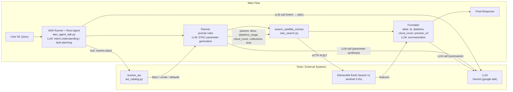

```mermaid
flowchart LR

    %% 左側：メインフロー
    subgraph MAIN["Main Flow"]
        direction TB
        U["User NL Query"]
        A["ADK Runner + Root Agent<br/>stac_agent_adk.py<br/>LLM: intent understanding / task planning"]
        P["Planner<br/>prompt rules<br/>LLM: STAC parameter generation"]
        S["search_satellite_scenes<br/>stac_search.py"]
        F["Formatter<br/>table: id, datetime,<br/>cloud_cover, preview_url<br/>LLM: summarization"]
        O["Final Response"]

        U --> A --> P --> S --> F --> O
    end

    %% 右側：外部ツール
    subgraph TOOLS["Tools / External Systems"]
        direction TB
        R["resolve_aoi<br/>aoi_catalog.py"]
        E["Element84 Earth Search v1<br/>sentinel-2-l2a"]
        LLM["LLM<br/>Gemini (google-adk)"]
    end

    %% ツール実行
    A -- "tool: resolve place" --> R
    R -- "bbox / center / defaults" --> P
    P -- "params: bbox, datetime_range,<br/>cloud_cover, collections, limit" --> S
    S -- "HTTP POST" --> E
    E -- "features" --> F

    %% LLM呼び出し（役割別）
    A -- "LLM call (intent → plan)" --> LLM
    P -- "LLM call (parameter synthesis)" --> LLM
    F -- "LLM call (summarize)" --> LLM


```